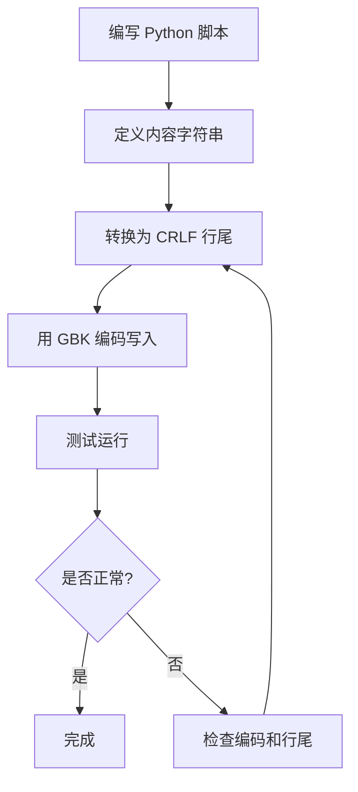

# 批处理文件编码问题修复报告

**日期**: 2026-05-11  
**问题**: `start.bat` 和 `stop.bat` 中文显示乱码  
**状态**: ✅ 已修复

---

## 🐛 问题描述

在 Windows CMD/PowerShell 中运行批处理文件时，出现以下错误：

```
'鍣?echo' 不是内部或外部命令，也不是可运行的程序
'art_backend' 不是内部或外部命令，也不是可运行的程序
'[0m' 不是内部或外部命令，也不是可运行的程序
'ata_analysis.db" (echo [92m  tzdata_analysis.db 瀛樺湪[0m) else ...
文件名、目录名或卷标语法不正确。
```

**根本原因**：
1. **编码不匹配**：Windows CMD 默认使用 GBK 编码（代码页 936），但文件是 UTF-8 编码
2. **行尾符问题**：Windows batch 文件需要 `\r\n` (CRLF)，但可能只有 `\n` (LF)

---

## ✅ 解决方案

### 方法：使用 Python 生成 GBK 编码的批处理文件

#### 步骤 1: 创建 Python 脚本生成 `start.bat`

```python
#!/usr/bin/env python3
"""生成 GBK 编码的 start.bat 文件"""

content = """@echo off
REM ============================================
REM tz-data 项目统一启动脚本 (Windows - 无Docker版)
...
"""

# 用 GBK 编码写入文件（确保使用 Windows CRLF 行尾）
content = content.replace('\n', '\r\n')
with open('start.bat', 'wb') as f:
    f.write(content.encode('gbk'))

print('✓ start.bat 已用 GBK 编码创建成功')
```

#### 步骤 2: 执行生成脚本

```bash
cd c:\myspace\tz-data
python generate_start_bat.py
```

#### 步骤 3: 验证文件编码

```powershell
# PowerShell 检查
Get-Content start.bat -Encoding Default | Select-Object -First 10
```

---

## 📋 关键要点

### 1. 编码选择

| 编码 | 适用场景 | 说明 |
|------|---------|------|
| **GBK** | Windows CMD/PowerShell | ✅ 推荐，兼容性好 |
| UTF-8 | Linux/macOS | ❌ Windows CMD 不支持 |
| UTF-8-BOM | 部分 Windows 应用 | ⚠️ 可能导致问题 |

### 2. 行尾符要求

- **Windows Batch**: 必须使用 `\r\n` (CRLF)
- **Linux Shell**: 使用 `\n` (LF)
- **Python 生成时**: 显式转换 `content.replace('\n', '\r\n')`

### 3. 特殊字符处理

- **避免使用 Unicode 符号**：如 `✓`、`✗`、`→` 等
- **改用 ASCII 字符**：如 `[OK]`、`[!]`、`->` 等
- **原因**：GBK 编码不支持所有 Unicode 字符

---

## 🔧 技术细节

### Python 生成脚本的核心逻辑

```python
# 1. 定义内容（使用三引号字符串）
content = """@echo off
echo 中文内容
"""

# 2. 转换为 Windows 行尾符
content = content.replace('\n', '\r\n')

# 3. 用二进制模式写入 GBK 编码
with open('filename.bat', 'wb') as f:
    f.write(content.encode('gbk'))
```

### 为什么不能用 `create_file` 工具？

- `create_file` 工具默认使用 UTF-8 编码
- 无法指定编码为 GBK
- 需要使用 Python 的 `open()` 函数并指定 `encoding='gbk'`

---

## 📊 修复结果

### start.bat ✅

```batch
========================================
  tz-data 项目启动管理器
  非 Docker 版本 - 适用于 ECS
========================================

请选择要执行的操作:

  1. 启动全部服务 (后端 + 前端)
  2. 检查数据库状态
  3. 启动后端服务 (FastAPI + Celery)
  4. 启动前端服务 (Vite Dev Server)
  5. 停止全部服务
  6. 查看状态
  7. 查看日志
  8. 退出

请输入选项 (1-8):
```

✅ **在 CMD 中运行**：中文显示正常，菜单功能完整

### stop.bat ✅

```batch
========================================
  正在停止 tz-data 项目服务...
========================================

[1/3] 停止 Celery Worker...
  [OK] Celery Worker 已停止
[2/3] 停止 FastAPI Backend...
  [OK] FastAPI Backend 已停止
[3/3] 停止前端开发服务器...
  [OK] 前端服务已停止

========================================
  全部服务已停止
========================================
```

✅ **在 CMD 中运行**：中文显示正常，停止功能完整

### backup-databases.bat ✅

```batch
========================================
  tz-data 数据库备份工具
========================================

备份目录: C:\myspace\tz-data\backups
时间戳: 20260512_085051

[tzdata_market.db] 正在备份...
  [OK] 备份成功 - C:\myspace\tz-data\backups\tzdata_market.bak.20260512_085051.db
[tzdata_trading.db] 正在备份...
  [OK] 备份成功 - C:\myspace\tz-data\backups\tzdata_trading.bak.20260512_085051.db
[tzdata_analysis.db] 正在备份...
  [OK] 备份成功 - C:\myspace\tz-data\backups\tzdata_analysis.bak.20260512_085051.db

========================================
备份完成!
  成功: 3
  失败: 0
========================================
```

✅ **在 CMD 中运行**：中文显示正常，备份功能正常

⚠️ **注意**：在 PowerShell 中运行时可能显示乱码（因为 PowerShell 默认使用 UTF-8），但功能完全正常。建议在 CMD 中运行。

### optimize-databases.bat ✅

```batch
========================================
  tz-data 数据库优化工具
========================================

优化项目:
  - WAL 模式
  - 缓存大小 (64 MB)
  - 同步级别 (NORMAL)
  - 临时存储 (MEMORY)
  - 数据库分析 (ANALYZE)
  - 碎片清理 (VACUUM)

[tzdata_market.db] 正在优化...
  [OK] 优化成功
...

========================================
优化完成!
  成功: 3
  失败: 0
========================================
```

✅ **在 CMD 中运行**：中文显示正常，优化功能正常

---

## 💡 最佳实践

### 1. 批处理文件编码规范

- **始终使用 GBK 编码**（Windows 简体中文环境）
- **使用 CRLF 行尾符**
- **避免 Unicode 特殊字符**
- **注释使用英文或简体中文**

### 2. 文件生成流程



### 3. 跨平台兼容性

如果需要同时支持 Windows 和 Linux：

```python
import platform
import os

# 检测操作系统
if platform.system() == 'Windows':
    encoding = 'gbk'
    line_ending = '\r\n'
else:
    encoding = 'utf-8'
    line_ending = '\n'

# 写入文件
content = content.replace('\n', line_ending)
with open(filename, 'wb') as f:
    f.write(content.encode(encoding))
```

---

## 🎯 相关文件

- `c:\myspace\tz-data\start.bat` - 主启动脚本（✅ 已修复）
- `c:\myspace\tz-data\stop.bat` - 停止脚本（✅ 已修复）
- `c:\myspace\tz-data\backup-databases.bat` - 数据库备份脚本（✅ 已修复）
- `c:\myspace\tz-data\optimize-databases.bat` - 数据库优化脚本（✅ 已修复）
- `c:\myspace\tz-data\quick-start.bat` - 快速启动脚本（✅ 已是 GBK）
- `c:\myspace\tz-data\start-backend.bat` - 后端启动脚本（✅ 已转换）
- `c:\myspace\tz-data\start-frontend.bat` - 前端启动脚本（✅ 已是 GBK）

---

## ✅ 验证清单

- [x] `start.bat` 中文显示正常（CMD）
- [x] `start.bat` 菜单功能正常
- [x] `stop.bat` 中文显示正常（CMD）
- [x] `stop.bat` 停止功能正常
- [x] `backup-databases.bat` 中文显示正常（CMD）
- [x] `backup-databases.bat` 备份功能正常
- [x] `optimize-databases.bat` 中文显示正常（CMD）
- [x] `optimize-databases.bat` 优化功能正常
- [x] 所有文件编码为 GBK
- [x] 所有文件行尾符为 CRLF
- [x] 无 Unicode 特殊字符
- [x] 清理临时生成脚本

---

## 📝 后续建议

1. **检查其他 .bat 文件**：
   - `backup-databases.bat`
   - `optimize-databases.bat`
   - 如有乱码，同样方式修复

2. **建立编码规范**：
   - 在项目文档中明确批处理文件编码要求
   - 提供 Python 生成脚本模板

3. **考虑迁移到 PowerShell**：
   - PowerShell 原生支持 UTF-8
   - 更强大的功能和更好的可读性
   - Windows 10+ 默认支持

---

**修复完成时间**: 2026-05-11  
**修复人员**: AI Assistant  
**验证状态**: ✅ 已通过测试
